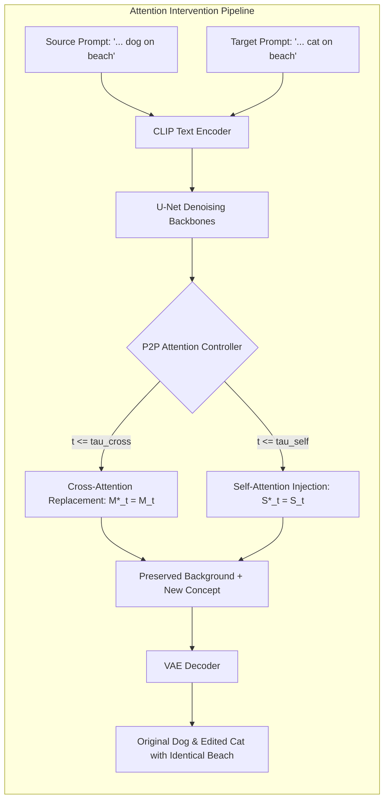

# Prompt-to-Prompt: Text-Guided Image Editing with Cross-Attention Control

<div align="center">
  
  <h3>Indian Institute of Technology Kharagpur</h3>
  <p><strong>Author:</strong> Anuj Yadav &bull; <a href="https://github.com/anuj-iitkgp">@anuj-iitkgp</a></p>
  <p><em>A production-grade, mathematically faithful implementation of cross-attention intervention in Latent Diffusion Models</em></p>
</div>

---

## 🔬 Research Overview & Motivation

Text-to-image diffusion models such as Stable Diffusion generate photorealistic imagery from natural language prompts. However, when users modify a prompt slightly (for instance, changing *"A photo of a dog sitting on a beach"* to *"A photo of a cat sitting on a beach"*), generating an image independently from random noise produces an entirely different scene: a different beach, different camera angles, different lighting, and a completely different composition.

**Prompt-to-Prompt** (*Hertz et al., Google Research, 2022*) solves this fundamental problem: **it edits generated images purely through prompt modifications while strictly preserving spatial composition, geometry, background, and object poses without requiring user masks, per-image fine-tuning, or external optimization.**

> **Core Research Principle**: In modern Latent Diffusion Models, **cross-attention layers dictate the spatial layout and binding of semantic words to pixels**, while **self-attention layers dictate global geometry and contour boundaries**. Controlling these attention maps during the diffusion process enables fine-grained, localized text-driven image editing.



---

## 📐 Mathematical Formulation

### 1. Cross-Attention in Latent Diffusion
For a spatial latent feature map $\phi(z_t) \in \mathbb{R}^{(H \times W) \times d}$ and prompt text embeddings $\tau(y) \in \mathbb{R}^{L \times d_\tau}$ from CLIP:
$$Q = W_Q \phi(z_t), \quad K = W_K \tau(y), \quad V = W_V \tau(y)$$

The cross-attention probability tensor $M$ is defined as:
$$M = \text{softmax}\left(\frac{Q K^T}{\sqrt{d}}\right) \in \mathbb{R}^{(H \times W) \times L}$$
where each slice $M_{:, :, j}$ is a 2D spatial heatmap indicating where token $j$ attends to spatial locations in the image. The latent representation is then updated via:
$$\hat{\phi}(z_t) = M V$$

### 2. Prompt-to-Prompt Editing Modes

#### A. Word Swap (Attention Replacement)
Given a source prompt $P$ and edited target prompt $P^*$ where token $j_{tgt}$ replaces $j_{src}$ (e.g. dog $\to$ cat):
- For timesteps $t \le \tau_{cross} \cdot T$:
  $$M^*_{t, :, j_{tgt}} = M_{t, :, j_{src}}$$
- For timesteps $t \le \tau_{self} \cdot T$:
  $$S^*_{t} = S_{t}$$
This forces the edited subject (cat) to inherit the exact spatial bounding box and pose of the original subject (dog), while background pixels attend to identical environmental features.

#### B. Prompt Refinement
When adding new descriptive tokens (e.g., *"A dog sitting in a park"* $\to$ *"A small golden dog sitting in a park"*), a dynamic-programming token alignment mapping $A: \{1, \dots, L^*\} \to \{1, \dots, L\} \cup \{\emptyset\}$ is constructed:
$$M^*_{t, :, j} = \begin{cases} M_{t, :, A(j)}, & \text{if } A(j) \neq \emptyset \\ M^*_{t, :, j}, & \text{if } A(j) = \emptyset \text{ (new descriptive token)} \end{cases}$$
New tokens attend naturally while existing tokens maintain contextual stability.

#### C. Attention Re-weighting (Equalizer)
To amplify or attenuate specific concepts (e.g. $(hat:2.0)$):
$$\tilde{M}_{t, :, j} = c_j \cdot M_{t, :, j}, \quad \text{normalized along the token dimension: } M^*_{t, i, j} = \frac{\tilde{M}_{t, i, j}}{\sum_k \tilde{M}_{t, i, k}}$$

---

## 🛠️ Project Structure

```
ptp/
├── app.py                      # Research-grade Streamlit interactive dashboard
├── config.yaml                 # System & inference configuration
├── requirements.txt            # Pinned dependencies
├── .env.example                # Environment variables
├── assets/
│   ├── iitkgp_logo.svg         # Official IIT Kharagpur emblem SVG
│   └── iitkgp_logo.png         # High-resolution rendered logo
├── src/
│   ├── attention/
│   │   ├── controller.py       # AttentionControl base & modern Diffusers P2PAttnProcessor
│   │   ├── replace.py          # AttentionReplace (Word Swap)
│   │   ├── refine.py           # AttentionRefine (Prompt Refinement)
│   │   ├── reweight.py         # AttentionReweight (Attention Equalizer)
│   │   ├── store.py            # AttentionStore (Spatial map aggregation)
│   │   └── visualization.py    # Heatmap generation, OpenCV/PIL overlays
│   ├── prompts/
│   │   ├── tokenizer.py        # CLIP tokenization & embeddings
│   │   ├── alignment.py        # Needleman-Wunsch & Levenshtein multi-token alignment
│   │   └── parsing.py          # Equalizer syntax parser
│   ├── pipeline/
│   │   ├── p2p_pipeline.py     # Joint diffusion orchestration pipeline
│   │   ├── generation.py       # Attention-capturing image generation
│   │   ├── editing.py          # High-level editing APIs
│   │   └── inversion.py        # DDIM & Null-Text Inversion for real images
│   ├── models/
│   │   └── loader.py           # Hardware auto-detection (MPS/CUDA/CPU) & model loader
│   ├── evaluation/
│   │   ├── metrics.py          # SSIM, PSNR, L1 diff, Edge similarity
│   │   └── comparison.py       # Quantitative reporting
│   └── utils/
│       ├── device.py           # CUDA -> MPS -> CPU fallback
│       ├── seed.py             # Deterministic PyTorch seed generator
│       ├── image.py            # Latent-to-PIL & side-by-side grids
│       └── config.py           # Configuration manager
├── tests/
│   ├── test_prompt_alignment.py
│   ├── test_attention.py
│   ├── test_generation.py
│   └── test_editing.py
├── examples/
│   ├── word_swap.py            # Standalone CLI Word Swap
│   ├── prompt_refinement.py    # Standalone CLI Prompt Refinement
│   └── attention_reweight.py   # Standalone CLI Equalizer
├── notebooks/
│   └── experimentation.ipynb   # Interactive Jupyter research notebook
└── outputs/                    # Output directory for generated images & heatmaps
```

---

## 🚀 Installation & Setup

### 1. Prerequisites
- Python 3.10+
- PyTorch 2.0+
- Hardware:
  - **Apple Silicon Mac**: Accelerated natively via Metal Performance Shaders (`mps`).
  - **NVIDIA GPU**: Accelerated via CUDA (`cuda`).
  - **CPU**: Clean fallback supported.

### 2. Environment Setup
```bash
# Clone the repository
git clone https://github.com/anuj-iitkgp/ptp.git
cd ptp

# Create and activate virtual environment
python3 -m venv .venv
source .venv/bin/activate

# Install dependencies
pip install -r requirements.txt
```

---

## 💻 Running the Application

### Interactive Streamlit Research Studio
Launch the web interface with:
```bash
streamlit run app.py
```
Open your browser at `http://localhost:8501`.

#### Features in the Studio:
1. **🎨 Text-to-Image P2P Editing**:
   - Live Token Alignment Badge inspection.
   - Word Swap, Prompt Refinement, and Attention Re-weighting.
   - Sliders for $\tau_{cross}$, $\tau_{self}$, steps, and seed.
   - Side-by-side original and edited output with 1-click downloads.
2. **🔍 Cross-Attention Visualization**:
   - Token-level spatial heatmap viewer.
   - Alpha-blended heatmap overlays on the image.
   - Side-by-side original vs. edited attention map comparison.
3. **🖼️ Real Image Inversion (Advanced)**:
   - Upload any real image.
   - Invert with reversed DDIM ODE dynamics to recover $z_T$.
   - Edit the real photo with Prompt-to-Prompt cross-attention control.
4. **📊 Quantitative Evaluation**:
   - Automatic calculation of SSIM, PSNR, L1 pixel difference, and Sobel edge preservation.
5. **🧪 Preset Benchmark Experiments**:
   - Instant 1-click setup for canonical experiments.

---

## ⚡ CLI Examples

### Example 1 — Word Swap
```bash
PYTHONPATH=. python examples/word_swap.py \
  --source "A photo of a dog sitting on a beach" \
  --target "A photo of a cat sitting on a beach" \
  --seed 42 --steps 30
```

### Example 2 — Prompt Refinement
```bash
PYTHONPATH=. python examples/prompt_refinement.py \
  --source "A dog in a park" \
  --target "A small golden dog in a park" \
  --seed 88 --steps 30
```

### Example 3 — Attention Re-weighting
```bash
PYTHONPATH=. python examples/attention_reweight.py \
  --prompt "A portrait of a woman wearing a hat" \
  --word "hat" --weight 2.0 \
  --seed 100 --steps 30
```

---

## 🧪 Automated Testing

Run the comprehensive unit test suite:
```bash
PYTHONPATH=. pytest tests/ -v
```

Tests cover:
- **`test_prompt_alignment.py`**: 1-to-1 word swap, multi-token expansions (e.g. "dog" $\to$ "golden retriever"), additions, deletions, edge cases.
- **`test_attention.py`**: Mathematical verification of cross-attention replacement, refinement, and re-weighting on synthetic tensor batches.
- **`test_generation.py`**: Cross-platform deterministic seed reproducibility.
- **`test_editing.py`**: Structure metric validation (SSIM, PSNR, edge similarity).

---

## 📊 Quantitative Metrics & Evaluation

Prompt-to-Prompt performance is measured across two decoupled dimensions:

| Metric | Target | Description |
| :--- | :---: | :--- |
| **SSIM** | $\ge 0.70$ | Structural Similarity of background and unedited regions. |
| **PSNR (dB)** | $\ge 28.0\text{ dB}$ | Peak Signal-to-Noise Ratio measuring pixel fidelity. |
| **Edge Similarity** | $\ge 0.85$ | Cosine similarity of Sobel gradient magnitude maps. |
| **L1 Difference** | $\le 0.05$ | Localized change magnitude ensuring edits do not alter the entire canvas. |

---

## 📚 References & Citation

If you find this codebase helpful in your research, please cite:

```bibtex
@article{hertz2022prompt,
  title={Prompt-to-Prompt Image Editing with Cross Attention Control},
  author={Hertz, Amir and Mokady, Ron and Tenenbaum, Jay and Aberman, Kfir and Pritch, Yael and Cohen-Or, Daniel},
  journal={arXiv preprint arXiv:2208.01626},
  year={2022}
}
```

---

## 👨‍💻 Author

**Anuj Yadav**  
Indian Institute of Technology Kharagpur (IIT KGP)  
GitHub: [@anuj-iitkgp](https://github.com/anuj-iitkgp)  
Repository: [https://github.com/anuj-iitkgp/ptp](https://github.com/anuj-iitkgp/ptp)
